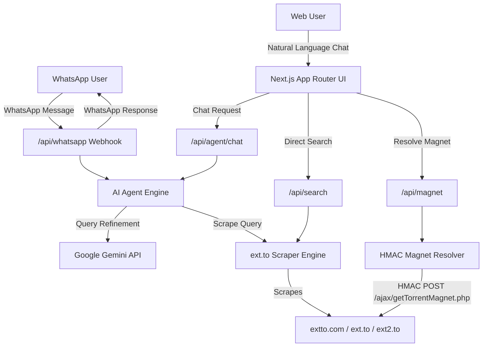

# ⚡ Sauceror - ext.to AI Agent & WhatsApp Bot

An autonomous AI Agent and WhatsApp Bot built with Next.js 14, Tailwind CSS, Google Gemini, and Cheerio. Sauceror indexes and scrapes **ext.to** (with automatic mirror failover and token-authenticated HMAC magnet resolution) and delivers verified magnet links with swarm health metrics through a modern web UI and WhatsApp.

---

## ✨ Features

- 🤖 **Autonomous AI Agent**: Natural language understanding powered by Gemini AI with smart heuristic fallbacks. Understands complex queries like *"Find me Interstellar in 1080p with good seeders"* or *"Latest Ubuntu LTS ISO"*.
- 🌐 **Robust ext.to Scraper Engine**: Real-time multi-mirror scraping (`extto.com`, `ext2.to`, `ext.to`) with category filtering, seed count extraction, and pagination.
- 🧲 **Automatic HMAC Magnet Token Resolution**: Reverse-engineered token and CSRF retrieval with SHA-256 HMAC signature computation to fetch verified `magnet:?xt=urn:btih:...` links directly from `/ajax/getTorrentMagnet.php`.
- 📱 **WhatsApp Bot & Live Simulator**:
  - Webhook endpoint (`/api/whatsapp`) supporting **Meta WhatsApp Cloud API** and **Twilio**.
  - Interactive in-browser smartphone simulator to test conversations instantly.
- 🎨 **Sleek Glassmorphic Web UI**:
  - AI Agent Chat interface with step-by-step thinking indicators.
  - Torrent Explorer with category pills (Movies, TV, Music, Games, Apps, Books, Anime) and quality filters.
  - 1-Click "Copy Magnet Link", "Open in Torrent Client" (`magnet:` deep links), and health score indicators.
- 🚀 **1-Click Vercel Ready**: Optimized for serverless and zero-config deployment.

---

## 🛠️ Architecture



---

## 🚀 Quick Start (Local Development)

### 1. Clone & Install Dependencies
```bash
git clone <your-repo>
cd sauceror
npm install
```

### 2. Configure Environment Variables (Optional)
Copy `.env.example` to `.env.local`:
```bash
cp .env.example .env.local
```
Add your optional Google Gemini API key:
```env
GEMINI_API_KEY=AIzaSy...
```
*(Note: Sauceror includes intelligent heuristic parsing, so it functions out of the box even without an API key!)*

### 3. Run Development Server
```bash
npm run dev
```
Open [http://localhost:3000](http://localhost:3000) in your browser.

---

## ☁️ Deploying to Vercel

1. Push your repository to GitHub.
2. Go to [vercel.com/new](https://vercel.com/new) and import your repository.
3. (Optional) Add Environment Variables in Vercel Project Settings:
   - `GEMINI_API_KEY`: Your Gemini API key from [Google AI Studio](https://aistudio.google.com/app/apikey)
   - `WHATSAPP_VERIFY_TOKEN`: `sauceror_verify_token` (or your custom secret)
   - `WHATSAPP_ACCESS_TOKEN`: Meta WhatsApp Cloud API access token
   - `WHATSAPP_PHONE_NUMBER_ID`: Meta Phone Number ID
4. Click **Deploy**!

---

## 📱 Setting Up WhatsApp Bot

### Option A: Meta WhatsApp Cloud API (Recommended)
1. Go to [Meta for Developers](https://developers.facebook.com/) and open your WhatsApp Business app.
2. Under **WhatsApp > Configuration**:
   - **Callback URL**: `https://your-project.vercel.app/api/whatsapp`
   - **Verify Token**: `sauceror_verify_token`
   - Click **Verify and Save**.
3. Under **Webhook fields**, click **Subscribe** to `messages`.
4. Add `WHATSAPP_ACCESS_TOKEN` and `WHATSAPP_PHONE_NUMBER_ID` to your Vercel Environment Variables.

### Option B: Twilio WhatsApp Sandbox
1. Open the [Twilio Console](https://console.twilio.com) and go to **Messaging > Try it out > Send a WhatsApp message**.
2. Under **Sandbox Settings > "When a message comes in"**:
   - Set HTTP Method to `POST`
   - Set URL to `https://your-project.vercel.app/api/whatsapp`
3. Click **Save** and text your sandbox number!

---

## 🧪 API Reference

| Endpoint | Method | Description |
|---|---|---|
| `/api/agent/chat` | `POST` | AI Agent chat execution with query analysis, scraping, and magnet resolution |
| `/api/search` | `GET` / `POST` | Direct ext.to search with category & sort filters |
| `/api/magnet` | `POST` | On-demand SHA-256 HMAC magnet link resolver for any torrent ID / detail URL |
| `/api/whatsapp` | `GET` | Meta Webhook subscription verification |
| `/api/whatsapp` | `POST` | WhatsApp message webhook handler (supports Meta, Twilio, & Simulator) |

---

## 📄 License
MIT License. Built for educational and research purposes.
